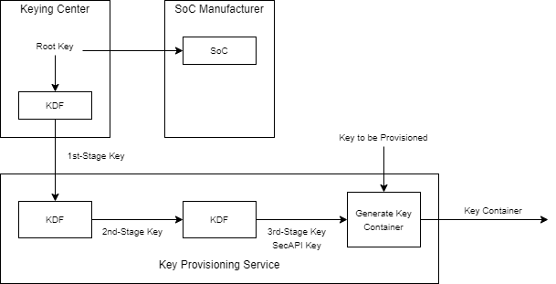
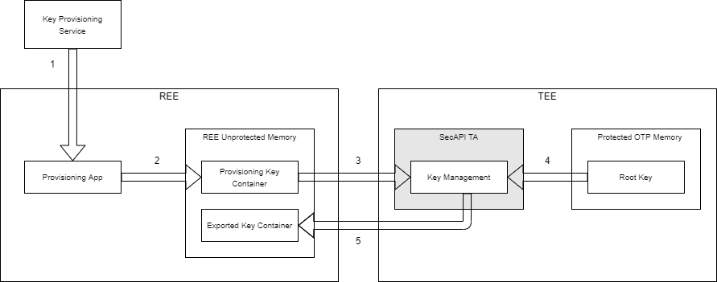
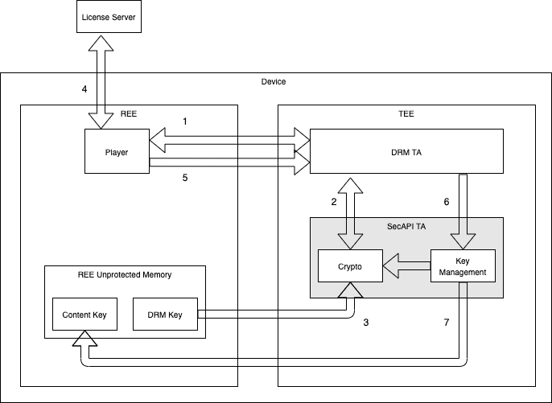
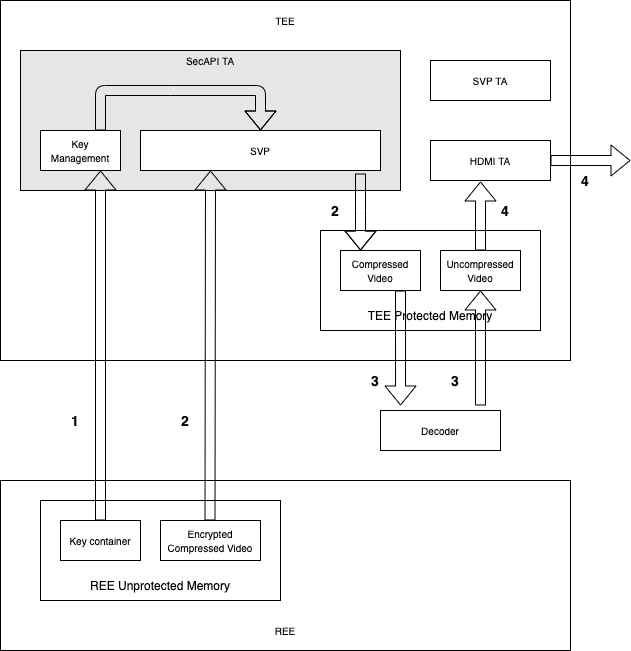

# Security API

## Table of Contents

1. [Introduction](#introduction)
1. [Terms and Definitions](#terms-and-definitions)
1. [SecAPI Overview](#secapi-overview)
1. [Sample Use Cases](#sample-use-cases)
1. [Robustness Rules](#robustness-rules)

## Introduction

The Security API (SecAPI) provides a cryptographic interface for video devices to support a common
set of robustness requirements for video content protection.

The Security API (SecAPI) provides a thread-safe C-type interface to cryptographic and key
management operations. The API enables applications to use keys and secret data without exposing
sensitive data and keys.

The processing environment for applications includes two environments: a Rich Execution Environment
(REE) and a Trusted Execution Environment (TEE). The API is implemented as a Trusted Application
(TA) in the TEE. The TEE ensures that device, application, and protocol secrets are not compromised.

The API may be invoked from client applications running in the REE or from other TAs that are
running in the TEE. The API is expected to support in-field provisioning of device credentials and
keys, including credentials and keys required for:

* Device activation and authentication (on X1 as well as for OTT partners, e.g. Netflix).
* Secure communication (e.g. TLS).
* DRM individualization (e.g. Widevine).

## Terms and Definitions

The following terms are used:

* `Client Application` An application running outside the TEE making use of the TEE API to access
  facilities and functions provided by Trusted Applications inside the TEE.
* `Client Key` A key that may be used by client applications using the SecAPI. Client keys are
  derived from a root key using a four-stage key ladder, or are derived from another client key, or
  are unwrapped by a SecAPI key or another client key. Intermediate stages of the key ladder are not
  observable or modifiable outside the SecAPI TA. Clear key client keys may also be loaded.
* `Execution Environment` A set of hardware and software components providing facilities necessary
  to support running of applications.
* `Host Processor` The general-purpose processor in the SoC to run client application software. The
  host processor is a component of the REE.
* `Key Container` A data structure that contains a key, metadata, and a signature to authenticate
  the key. The metadata typically includes a description of the key and associated key usage rights.
  The key is typically encrypted such that the plain-text value is accessible only in a TEE. The key
  container may be created by a key provisioning service to provision keys to the device in the
  field, and may be created by the device to export a key from the SecAPI TA for storage outside the
  TEE.
* `Key Derivation Function` A function that, with a key and other data as inputs, generates a
  symmetric key.
* `Key Ladder` A chain of cryptographic operations such that each operation gets its key from the
  output of the previous operation. The result of the final operation is a key that can be used for
  general cryptographic operations (e.g. to decrypt content). Intermediate stages of the key ladder
  are not observable or modifiable outside the SecAPI TA.
* `Key Rights` Uses that are authorized for a key (e.g. data decryption, key unwrapping). Key rights
  in this API also include restrictions on when a decryption key may be used, specifically
  restrictions based on available video output ports (e.g. a decryption key may only be used if HDCP
  2.2 is enforced on the video output).
* `Key Wrapping` A method of encrypting a key, along with key usage information and integrity
  information, that provides confidentiality and integrity protection.
* `Load Key` Decrypt or import a key for use by the SecAPI TA.
* `OTP` One time programmable.
* `Rich Execution Environment` An environment that is provided and governed by a typical OS (e.g.
  Linux, Android, iOS) outside the TEE. This environment and any applications running on it are
  considered untrusted.
* `Root Key` A device unique secret key stored in OTP. A root key is not observable by access
  outside the TEE. A root key is used as the first stage in the device key ladder.
* `SecAPI Key` A key that is derived from a root key using a three-stage key ladder. Intermediate
  stages of the key ladder are not observable or modifiable outside the SecAPI TA. A SecAPI key
  cannot be used by client applications or other TAs. That is, only the SecAPI can use a SecAPI key.
* `Secure Video Path` An end-to-end video path (decrypted compressed content to rendering/output)
  that is hardware isolated such that the decrypted content is protected from unauthorized software
  and hardware. Content cannot be read or accessed by unauthorized software or hardware.
* `Trusted Application` An application that runs in a TEE.
* `Trusted Execution Environment` An environment that enforces that only authorized code can execute
  within the TEE, and data used by that code cannot be read or tampered with by code outside the
  TEE. The TEE uses an isolation mechanism to ensure that one TA cannot read, modify or delete the
  data and code of another TA.
* `Unwrap a Key` Decrypt a key with a second key.
* `Wrap a Key` Encrypt a key with a second key.

## SecAPI Overview

The SecAPI is implemented as a TA. The SecAPI TA exposes an interface to client applications in the
REE and an interface to other TAs in the TEE.

The SecAPI is a blocking API. That is, the API blocks while waiting for underlying tasks to complete
before returning execution control to the calling client application or TA.

The API exposes an interface to provide:

* [Key Management](#key-management)
* [Cryptographic Operations](#cryptographic-operations)
* [SVP Operations](#svp-operations)

### Key Management

The API provides the following key management capabilities:

* Key generation.
* Key agreement.
* Key derivation.
* Key unwrapping.
* Key export and import.
* Key provisioning.
* Enforcement of key usage rights and restrictions.

The API supports symmetric keys, RSA keys, ECC, and Diffie-Hellman (DH) keys.

Persistent storage of keys is out of scope for the API.

Key container formats are out of scope for the API. However, each key container definition must
support a capability to specify a list of TAs that are entitled to use the key contained in the
container. Each entitled TAs is identified by a TA UUID compliant with
[RFC 4122](https://tools.ietf.org/html/rfc4122).

Key containers used to provision keys for the SecAPI must use a SecAPI key to encrypt the keys that
are getting provisioned. Each such key container must be authenticated by a SecAPI key. When a key
provisioning service is used to provision SecAPI key containers in fielded devices, the service
depends on a priori knowledge of a key derived from the device's root key. This allows the key
provisioning service to subsequently derive the SecAPI keys used to encrypt the key carried in the
container as well as authenticate the container.

1. A keying center generates SoC root keys.
1. The keying center delivers the SoC root keys to the SoC manufacturer. The SoC manufacturer writes
   the root keys to SoC OTP memory.
1. The keying center performs the first stage derivation of a container encryption key and delivers
   the result to the key provisioning service.
1. The key provisioning service, starting with the first stage derived key, performs second and
   third stage derivation to generate the SecAPI key used to protect the confidentiality of a
   field-provisioned key delivered in a SecAPI key container.

### Cryptographic Operations

The API provides the following cryptographic capabilities:

* AES cipher algorithm using ECB, CBC, and CTR mode.
* AES GCM authenticated encryption and decryption.
* RSA decryption using PKCS and OAEP padding.
* RSA signature generation using PKCS and PSS padding.
* ECDSA signature generation.
* HMAC calculation using SHA1, SHA-256, SHA-384, and SHA-512.
* AES CMAC calculation.
* Random number generation.

Public key operations are out of scope for the API. Digest operations are also out of scope for the
API since digest operations do not require access to keys.

### SVP Operations

The API provides the following SVP capabilities:

* Protected buffer operations, including buffer allocation, deallocation, writes, and copies.
* AES cipher operations on data in protected buffers using CBC and CTR mode.

The device must provide a mechanism to the SecAPI TA to determine whether an SVP is enforced. The
device must provide a mechanism to the SecAPI TA to determine whether an SVP buffer is wholly
contained within the restricted SVP memory region.

The control of HDCP and other outputs is out of scope for the API. This is the responsibility of an
HDCP TA, for example. The device must provide a mechanism to the SecAPI TA to determine what video
outputs are currently enabled.

## SecAPI Performance

It is the responsibility of the SoC vendor to optimize their implementation to reduce latency to
ensure sufficient decryption performance in order to prevent poor video playback quality issues.
This reference implementation is implemented with simple examples of how to perform cryptographic
operations using OpenSSL. It has not been optimized to provide the fastest possible cryptographic
operations.

## Sample Use Cases

### In-Field Key Provisioning

The diagram below presents an overview of the role of the SecAPI TA in key provisioning.

1. A provisioning client application obtains a key container from the key provisioning service.
1. The provisioning application writes the key container to REE memory.
1. The SecAPI TA copies the key container into the TEE.
1. The SecAPI TA uses the root key ladder to derive the SecAPI key that is used to encrypt the key in
   the key container. The SecAPI TA decrypts the key and verifies the container authentication
   data.
1. The SecAPI generates an export key container and returns the export key container to the calling
   client application. The client application places the container in the file system for
   persistent storage.

### DRM License Acquisition

The diagram below presents an overview of the role of the SecAPI TA in DRM license acquisition.

1. The player determines the media type and invokes the DRM TA to obtain a license request.
1. The DRM TA creates the license request and invokes the SecAPI to sign the request.
1. The SecAPI TA imports the DRM key, signs the license request, and returns the signed request to
   the DRM TA. The DRM TA provides the license request to the player.
1. The player obtains a license from the DRM license server.
1. The player provides the license to the DRM TA to process the license.
1. The DRM TA invokes the SecAPI TA to unwrap the content key.
1. The SecAPI unwraps the content key. The content key may be exported in an export key container
   if the use case requires persistent storage for the content key (i.e. if the content key is
   cacheable).

### SVP Content Decryption

The diagram below presents an overview of the role of the SecAPI TA in SVP content decryption. Prior
to content decryption a DRM TA acquires a license, unwraps the key and invokes the SecAPI TA to
export the content key for storage in the REE.

1. An SVP TA initializes the SVP.
1. The content key is imported by the SecAPI TA.
1. The encrypted compressed content is decrypted into an SVP buffer.
1. The SVP is configured to allow the decoder to access protected TEE memory. The decoder
   decompresses the video into an SVP buffer.
1. An HDCP TA outputs HDCP-protected video.

## Robustness Rules

Implementations of this API must conform to the following:

* SecAPI keys must be derived from a secret OTP root key. SecAPI keys must be derived by the SoC's
  hardware key ladder, or derived in the SecAPI TA.
* Derived, generated and unwrapped keys must not be observable or modifiable by access outside the
  SecAPI TA.
* Exported keys must be decrypted only in the SecAPI TA. Client applications must not be able to
  decrypt exported keys.
* Exported keys must be encrypted with a SecAPI key.
* Exported keys must be stored with an integrity mechanism. The SecAPI TA must not use a key if the
  integrity is compromised.
* Exported keys must not be observable or modifiable by access outside the SecAPI TA.
* Exported keys must maintain key usage rights. The usage rights must be cryptographically bound to
  the key.
* The SecAPI TA must not load or use a key if the usage rights compliance cannot be enforced or
  confirmed. For example, if specified output protections are not enabled, or cannot be confirmed,
  then the SecAPI TA must not load the key. Usage rights include entitled TA restrictions.
* The SecAPI TA must not embed clear keys in source code.
* Intermediate stages of key derivations, in either the key ladder or in a KDF, must not be
  observable or modifiable by access outside the SecAPI TA.
* TEE memory used to store plain-text keys must be isolated from other data memory. The SecAPI must
  protect plain-text keys in the TEE such that memory management functions cannot be used to expose
  keys to other TAs in the TEE.
* Cipher operations must be implemented in the TEE such that the key is not observable or modifiable
  during the operation by access external to the SecAPI TA.
* Client applications and TAs other than the SecAPI TA must be restricted to using a client key.
  Client applications and other TAs must not be able to use a SecAPI key. Client applications must
  not be able to re-derive a SecAPI key for its own use. That is, a client must not be able to use a
  three-stage key ladder to derive a key from a SecAPI root key.
* Key containers used to provision keys for the SecAPI must use a SecAPI key to encrypt the key. The
  key container must be authenticated by a SecAPI key.
* The SecAPI TA must have access to a device service that enables the SecAPI TA to determine whether
  SVP is configured and enabled.
* The SecAPI TA must have access to a device service that enables the SecAPI TA to determine what
  video outputs are currently enabled.
