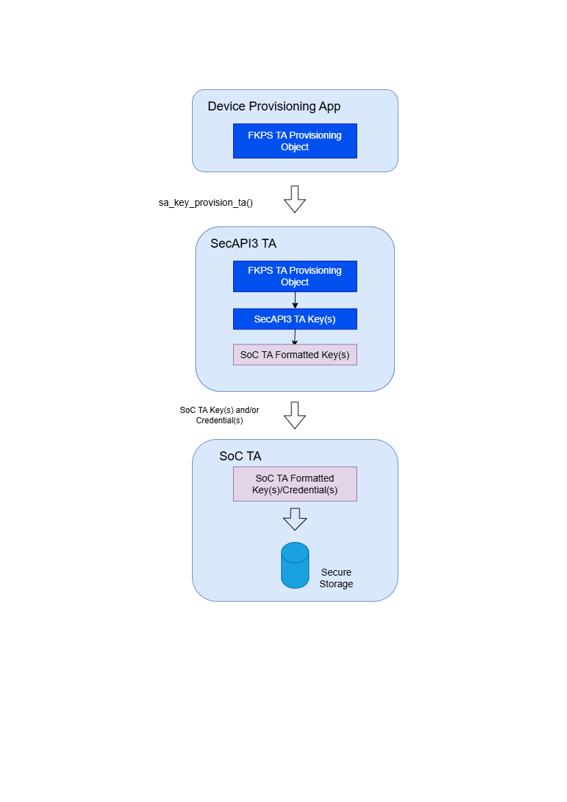

# RFC 0009-TA Key Provisioning

- Feature Name: TA Key Provisioning
- Author(s): Mike Habrat
- Start Date: 2023-10-31
- RFC PR: [RFC-0009](https://github.com/rdkcentral/tasecureapi/pull/100)
- Leader(s): Mike Habrat, Joe Hewitt, Richard Woh

## Introduction

Security API (SecAPI) provides the ability to provision keys using a container protected via a SoC
specific key for use within Trusted Execution Environment (TEE) based SecAPI Trusted Applications
(TA). Usage of these provisioned keys is limited to SecAPI, requiring Rich Execution Environment
(REE) based applications and TEE TAs to use the SecAPI for all key and cryptographic operations.
This prevents the use of SoC vendor-based TAs which have been developed and independently verified
via external partners and third-party security audits.

In order to expand the ecosystem of potential TAs and lower the barrier to incorporating SoC vendor
based TAs, a new SecAPI feature is proposed to import keys into the SecAPI TA, convert the keys to a
format accepted by a SoC vendor-based TA, and provision that key into corresponding TA without
exposing the keys to the REE environment.

## Motivation / use-cases

The creation of this new SecAPI key provisioning API:

+ Allows existing, non-SecAPI based TAs such as SoC vendor-based Digital Rights Management (DRM) TAs
  to be used in systems which utilize SecAPI for in-field key provisioning keys. This eliminates the
  requirement for existing SoC vendor-based TAs to be rewritten to use SecAPI functions to wield
  key(s).
+ Eliminates the need for independent third-party verification and security audits on SOC vendor
  based DRM TAs since there are no changes to the DRM TA implementation.
+ Maintains key privacy and protection by keeping all access and usage of the unencrypted key value
  within the TEE domain, preventing exposure to the REE space.
+ Avoids onboarding existing SoC vendors with existing in-field key provisioning infrastructure and
  third-party keying providers.
+ Eliminates the need to re-provision devices in the field with new keys in the SoC vendor TA
  format.

Initial use cases will be focused on SoC vendor-based DRM TAs.

## Updates/Obsoletes

None.

## Affected platforms

All platforms using the SecAPI.

## Open Source Dependencies

None.

## Detailed Design

A new SecAPI function is proposed to support the provisioning of keys from an operator's key
provisioning service to a specific TA:

```c
sa_status sa_key_provision_ta (
  sa_key_type_ta ta_key_type,
  const void* in,
  size_t in_length,
  void* parameters)
```

### Description

This function, implemented by SoC vendors, will handle the unwrapping of keys and credentials
protected via the the operator's key provisioning service and convert the materials into a format or
structure that the TA is able to ingest and utilize.

Keys and credentials may be securely stored within the TA. However, this storage mechanism is not
required. In order to facilitate a wide variety of SoC vendor TA implementatons and to support key
and credential updates from the operator's key provsioning service, the `sa_key_provision_ta`
function should support key loading on a regular basis, e.g. code initialization, device restart,
device power cycle start from persistently stored materials in the REE domain. The persistent
materials may be stored in a protected format in the file system of the device upon reception from
the operator's key provisioning service. the operator's key provisioning materials may be loaded
into the SoC vendor TA via a separate provisoning application not associated with the TA-specific
application.

### API Parameters

+ `ta_key_type` (enum) specifies the type of key being provisioned to the TA as defined in
  [TA Key Type Definition](#ta-key-type-definition).
+ `in` (void pointer) pointer to the input key and credential data.
+ `in_length` (integer) size of the data buffer pointed to by `in` in bytes.
+ `parameters` (pointer) format specific parameters for the protection key used by the key
  provisioning service. Keys delivered via the operator's key provisioning service are typically
  of key format type SA_KEY_FORMAT_SOC which correspond to the import parameters for a SOC key
  container as specified via the structure `sa_import_parameters_soc`. Since the TA key will
  be provisioned and wielded by the TA rather than the SecAPI, the value of `object_id` is ignored.

### TA Key Type Definition

The operator provisioning key type will be communicated through the following enumeration:

```c
enum sa_key_type_ta {
  WIDEVINE_OEM_PROVISIONING,
  PLAYREADY_MODEL_PROVISIONING,
  APPLE_MFI_PROVISIONING,
  APPLE_FAIRPLAY_PROVISIONING,
  NETFLIX_PROVISIONING};
```

**Widevine OEM Provisioning Structure**

The object provided as input to the `sa_key_provision_ta` API via the `in` parameter for the
`WIDEVINE_OEM_PROVISIONING` key type contains the following Widevine OEM Provisioning 3.0 model
properties.

```c
struct {
  unsigned int oemDevicePrivateKeyLength;
  void * oemDevicePrivateKey;
  unsigned int oemDeviceCertificateLength;
  void * oemDeviceCertificate;
} WidevineOemProvisioning;
```

**PlayReady Model Provisioning Structure**

The object provided as input to the `sa_key_provision_ta` API via the `in` parameter for the
`PLAYREADY_MODEL_PROVISIONING` key type contains the following properties.

```c
struct {
  unsigned int modelType; // 2K or 3K
  unsigned int privateKeyLength;
  void * privateKey;
  unsigned int modelCertificateLength;
  void * modelCertificate;
} PlayReadyProvisioning;
```

**Apple MFi Provisioning Structure**

The object provided as input to the `sa_key_provision_ta` API via the `in` parameter for the
`APPLE_MFI_PROVISIONING` key type contains the following properties.

```c
struct {
  unsigned int mfiBaseKeyLength;
  void * mfiBaseKey;
  unsigned int mfiProvisioningObjectLength;
  void * mfiProvisioningObject;
} AppleMfiProvisioning;
```

**Apple FairPlay Provisioning Structure**

The object provided as input to the `sa_key_provision_ta` API via the `in` parameter for the
`APPLE_FAIRPLAY_PROVISIONING` key type contains the following properties.

```c
struct {
  unsigned int fairPlaySecretLength;
  void * fairPlaySecret;
} AppleFairPlayProvisioning;
```

**Netflix Provisioning Structure**

The object provided as input to the `sa_key_provision_ta` API via the `in` parameter for the
`NETFLIX_PROVISIONING` key type contains the following properties.

```c
struct {
  unsigned int hmacKeyLength;
  void * hmacKey;                  // Kdh
  unsigned int wrappingKeyLength;
  void * wrappingKey;              // Kdw
  unsigned int esnContainerLength;
  void * esnContainer;             // ESN
} NetflixProvisioning;
```

### Provisioning Flow



1.	Field provisioning service delivers the encrypted TA Key to the device.
2.	The TA Key is imported and provisioned to SecAPI3 using new API: `sa_key_provision_ta`.
3.	SecAPI3 TA decrypts TA Key and converts key to SOC vendor TA Key format.
4.	SecAPI3 TA calls the SOC vendor-specific API to deliver the key to the TA.
5.	The key will be loaded for use within the TA. If the key received by the TA is new or updated
    and the TA supports secure storage, it will store the key to TA Secure Storage.
6.	This provisioning flow (Steps 2-5) will occur upon every device reboot/initialization. SOC
    Vendor TA Key updates will only be written to TAs supporting secure store upon receiving a new
    or updated key. The TA Key is not imported/stored in SecAPI3 when the sa_key_provision_ta() API
    is used.

### Error Status

The `sa_key_provision_ta` API will return one of the following status conditions:

+ SA_STATUS_OK - Operation succeeded.
+ SA_STATUS_INVALID_KEY_FORMAT - Input data failed the format validation.
+ SA_STATUS_NULL_PARAMETER - `ta_key_type`, `in`, `in_length`, or the key provisioning object
  parameters are NULL.
+ SA_STATUS_INVALID_PARAMETER
  - Invalid key format.
  - Invalid format value.
  - Invalid format specific parameter value encountered.
+ SA_STATUS_OPERATION_NOT_SUPPORTED - Implementation does not support the specified operation.
+ SA_STATUS_SELF_TEST - Implementation self-test has failed.
+ SA_STATUS_VERIFICATION_FAILED - Signature verification has failed.
+ SA_STATUS_INTERNAL_ERROR - An unexpected error has occurred.

## Drawbacks

Drawback considerations:

+ Key materials exposed to two TAs: SecAPI and SoC vendor-based TAs thereby requiring secure
  implementations for both TAs.
+ Requires key loading synchronization to ensure the current most version of the key and credentials
  are provisioned to the SoC vendor-based TAs.

## Alternatives considered

The following alternate approaches have been considered but were deemed barriers to entry for
existing brownfield implementations due to key re-provisioning requirements and complexity in
feature management and rollbacks:

+ Update the key provisioning infrastructure to handle the key format conversion to SoC vendor-based
  TA expectations.
+ Ingest SoC vendor-based TA key credentials into the key provisioning infrastructure.

## Unresolved questions

None.

## Future possibilities

+ Support for Widevine 2.0 provisioning model.
+ Support for Widevine 4.0 provisioning model.

## References

None.
